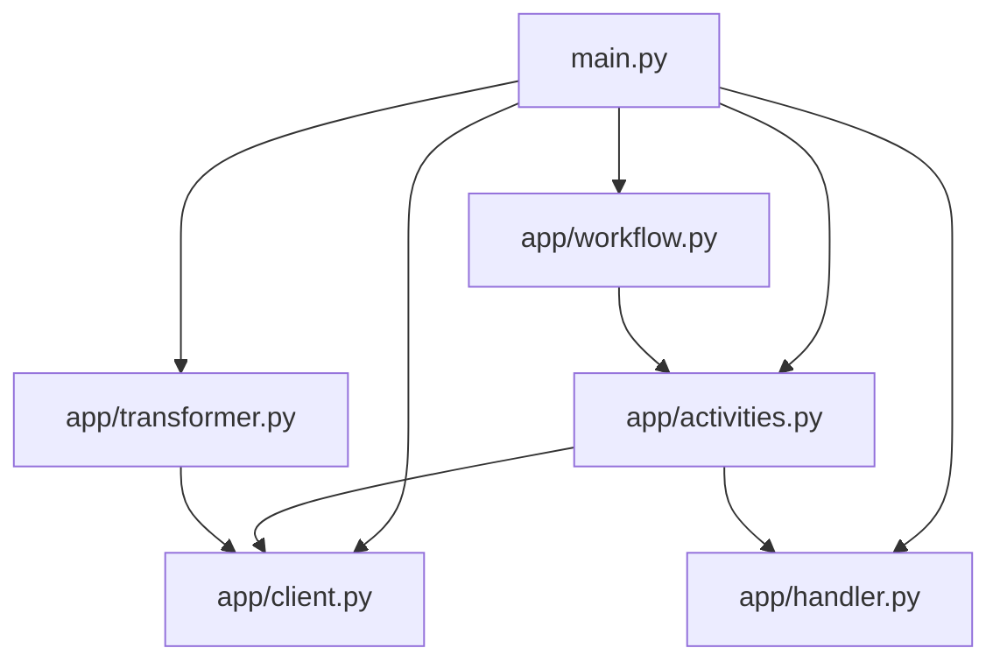

# GitHub App

A powerful application that extracts metadata from GitHub repositories and transforms it into a standardize Atlan format. Built with Atlan's Application SDK for robust workflow management and intelligent metadata extraction.

## Demo Video

Watch a full walkthrough of the application in action, including setup, workflow execution, and key technical decisions:

[](https://youtu.be/9k1MBi87k2o)

https://youtu.be/9k1MBi87k2o

## Key Engineering Challenges & Solutions

See [docs/challenges.md](docs/challenges.md) for a detailed list of technical challenges, solutions, and outcomes encountered during development.

## Prerequisites

- Python 3.11+
- [uv](https://docs.astral.sh/uv/) package manager
- [Dapr CLI](https://docs.dapr.io/getting-started/install-dapr-cli/)
- [Temporal CLI](https://docs.temporal.io/cli)
- GitHub Personal Access Token

### Installation Guides

- [macOS Setup Guide](https://github.com/atlanhq/application-sdk/blob/main/docs/docs/setup/MAC.md)
- [Linux Setup Guide](https://github.com/atlanhq/application-sdk/blob/main/docs/docs/setup/LINUX.md)
- [Windows Setup Guide](https://github.com/atlanhq/application-sdk/blob/main/docs/docs/setup/WINDOWS.md)

## Quick Start

1. **Download required components:**

   ```bash
   uv run poe download-components
   ```

2. **Set up environment variables (see .env.example)**

3. **Start dependencies (in separate terminal):**

   ```bash
   uv run poe start-deps
   ```

4. **Run the application:**
   ```bash
   uv run main.py
   ```

**Access the application:**

- **Web Interface**: http://localhost:8000
- **Temporal UI**: http://localhost:8233

## Features

- Automated metadata extraction from GitHub repositories
- Intelligent repository analysis and classification
- Real-time workflow status tracking via Temporal
- Robust error handling and retry mechanisms
- Standardized metadata transformation to Atlan format
- Windows-compatible file handling with fallback strategies

## Architecture & Design Notes

- **Why GitHub was chosen as the data source:**
  GitHub is a widely used platform with rich, real-world metadata. It allows demonstration of schema extraction, business context enrichment, and quality metrics, making it ideal for showcasing Atlan’s Apps Framework capabilities.

- **Component Interaction:**
  The app is modular:

  - **Activities** handle API calls, data extraction, transformation, and upload.
  - **Workflows** orchestrate the sequence of activities, manage state, and handle retries.
  - **Transformers** process and standardize raw metadata into Atlan-compatible format.
  - **Handlers/Clients** encapsulate business logic and API communication.

- **Key Design Decisions:**
  - **Modularity:** Each function is separated for maintainability and extensibility.
  - **Error Handling:** Robust logging and retry logic ensure reliability, especially for API and file system operations.
  - **Extensibility:** The architecture supports adding new data sources or transformation logic with minimal changes.
  - **Cross-platform Compatibility:** Special handling for Windows file operations and Unicode encoding.
  - **User Experience:** Real-time feedback in the frontend and clear error messages for smooth operation.

## Project Structure



```
github/
├── app/                # Core application logic
│   ├── activities.py   # GitHub API interaction activities
│   ├── client.py       # GitHub API client implementation
│   ├── handler.py      # Business logic for GitHub operations
│   ├── transformer.py  # Metadata transformation logic
│   └── workflow.py     # Workflow definitions and orchestration
├── components/         # Dapr components (auto-downloaded)
├── frontend/           # Web interface assets
├── deploy/            # Installation and deployment files
├── local/              # Local data storage and artifacts
├── models/             # Data models and schemas
├── main.py             # Application entry point and initialization
├── pyproject.toml      # Dependencies and config
└── README.md           # This file
```

## Development

### Stop Dependencies

```bash
uv run poe stop-deps
```

### Run Tests

```bash
uv run pytest
```

> [!NOTE]
> Make sure you have a `.env` file that matches the [.env.example](.env.example) file in this directory.

## Workflow Process

1. **Initialization**: The application sets up the GitHub client and workflow components
2. **Authentication**: Validates GitHub Personal Access Token and API connectivity
3. **Preflight Check**: Tests access to specified GitHub user/organization
4. **Repository Discovery**: Fetches all accessible repositories for the target owner
5. **Metadata Extraction**:
   - Retrieves repository information (name, description, language, etc.)
   - Captures ownership and permission details
   - Extracts repository statistics and configuration
6. **Data Processing**: Flattens nested GitHub API responses for analysis
7. **Transformation**: Converts raw GitHub data into Atlan-compatible format
8. **Storage**: Saves processed data as Parquet files and JSON for upload
9. **Upload to Atlan**: Migrates transformed metadata to Atlan storage system

## Learning Resources

- [Atlan Application SDK Documentation](https://github.com/atlanhq/application-sdk/tree/main/docs)
- [GitHub API Documentation](https://docs.github.com/en/rest)
- [Python FastAPI Documentation](https://fastapi.tiangolo.com/)
- [Temporal Workflow Documentation](https://docs.temporal.io/)

## Contributing

We welcome contributions! Please feel free to submit a Pull Request.
