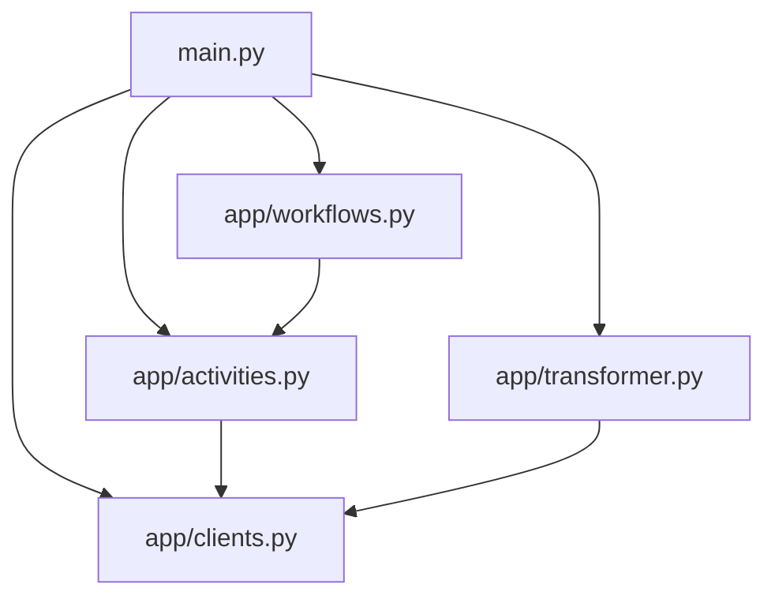

# 🗃️ MySQL App

A powerful application that extracts metadata from MySQL databases and transforms it into a standardized format. Built with Application SDK for robust workflow management.

## Prerequisites

- Python 3.11+
- [uv](https://docs.astral.sh/uv/) package manager
- [Dapr CLI](https://docs.dapr.io/getting-started/install-dapr-cli/)
- [Temporal CLI](https://docs.temporal.io/cli)
- MySQL database access

### Installation Guides
- [macOS Setup Guide](https://github.com/atlanhq/application-sdk/blob/main/docs/docs/setup/MAC.md)
- [Linux Setup Guide](https://github.com/atlanhq/application-sdk/blob/main/docs/docs/setup/LINUX.md)
- [Windows Setup Guide](https://github.com/atlanhq/application-sdk/blob/main/docs/docs/setup/WINDOWS.md)

## Quick Start

1. **Download required components:**
   ```bash
   uv run poe download-components
   ```

2. **Set up environment variables (see .env.example)**

3. **Start dependencies (in separate terminal):**
   ```bash
   uv run poe start-deps
   ```

4. **Run the application:**
   ```bash
   uv run main.py
   ```

**Access the application:**
- **Web Interface**: http://localhost:8000
- **Temporal UI**: http://localhost:8233

## Features

- Automated metadata extraction from MySQL databases
- Structured workflow for database, schema, table, and column extraction
- Real-time workflow status tracking
- Robust error handling and retry mechanisms
- Standardized metadata transformation

## Project Structure



```
mysql/
├── app/                # Core application logic
│   ├── sql/           # SQL query templates
│   ├── activities.py  # Database interaction activities
│   ├── clients.py     # MySQL client implementation
│   ├── transformer.py # Metadata transformation logic
│   └── workflows.py   # Workflow definitions and orchestration
├── components/         # Dapr components (auto-downloaded)
├── frontend/           # Web interface assets
├── deploy/            # Installation and deployment files
├── local/              # Local data storage
├── models/             # Data models and schemas
├── main.py             # Application entry point and initialization
├── pyproject.toml      # Dependencies and config
└── README.md           # This file
```

## Development

### Stop Dependencies
```bash
uv run poe stop-deps
```

### Run Tests
```bash
uv run pytest
```

> [!NOTE]
> Make sure you have a `.env` file that matches the [.env.example](.env.example) file in this directory.

## Workflow Process

1. **Initialization**: The application sets up the SQL client and workflow components
2. **Preflight Check**: Validates database connectivity and permissions
3. **Metadata Extraction**:
   - Fetches database information
   - Extracts schema details
   - Retrieves table metadata
   - Gathers column information
4. **Transformation**: Converts raw metadata into standardized format
5. **Output**: Saves the transformed metadata to specified location


## Learning Resources

- [Atlan Application SDK Documentation](https://github.com/atlanhq/application-sdk/tree/main/docs)
- [MySQL Documentation](https://dev.mysql.com/doc/)
- [Python FastAPI Documentation](https://fastapi.tiangolo.com/)

## Contributing

We welcome contributions! Please feel free to submit a Pull Request.
